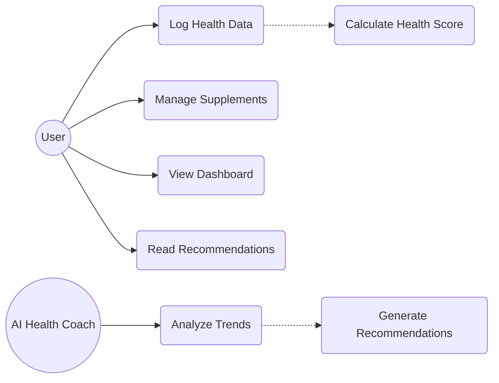
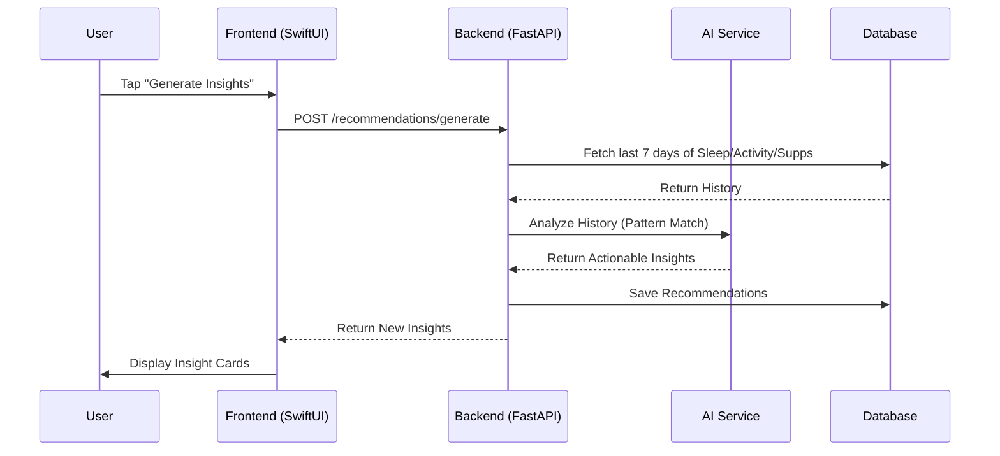
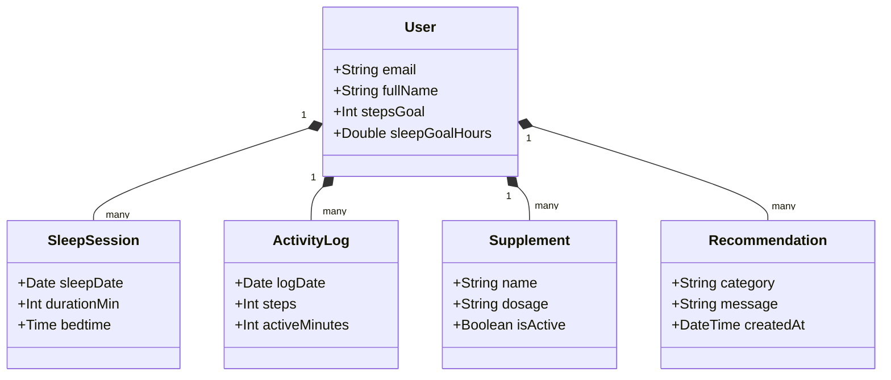
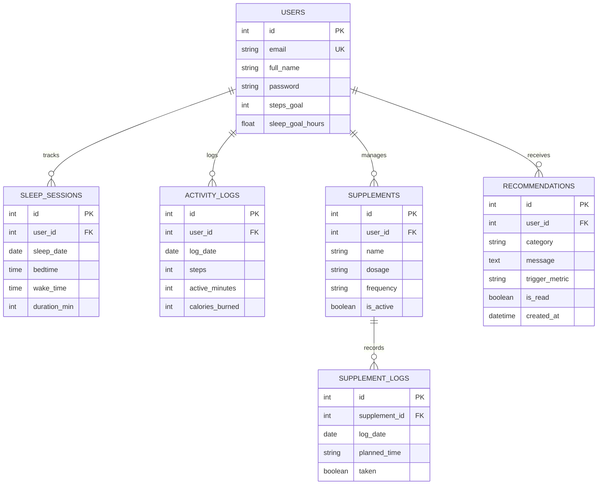

# Project Report: HealthMonitor System Analysis

## 1. Project Requirements

### Functional Requirements
- **User Authentication**: Secure sign-up/login with encrypted password storage and JWT session management.
- **Health Data Logging**: Manual and automated entry for sleep sessions, daily step counts, and active minutes.
- **Supplement Management**: CRUD operations for supplement lists with timed notification scheduling.
- **AI Recommendation Engine**: Automated generation of personalized wellness advice based on 7-day historical trends.
- **Unified Dashboard**: Real-time aggregation of all health metrics into a single "Health Score" for immediate progress assessment.

### Non-Functional Requirements
- **Performance**: Backend response times under 200ms for standard data retrieval.
- **Scalability**: Decoupled architecture to support a growing user base via FastAPI's asynchronous capabilities.
- **Reliability**: ACID-compliant data persistence using PostgreSQL.
- **Usability**: High-fidelity SwiftUI interface with support for dark mode and accessibility features.

---

## 2. Relevance, Novelty, and Practical Significance

### Relevance
With the global shift towards preventative healthcare, there is a critical need for tools that simplify complex health data. HealthMonitor addresses this by centralizing disparate metrics (sleep, exercise, and nutrients) into a single, understandable dashboard.

### Novelty
HealthMonitor's novelty lies in its **Hardware-Free AI Coaching**. While most competitors require expensive wearables (Whoop, Oura), HealthMonitor utilizes advanced statistical analysis and pattern matching to provide high-level insights using only the smartphone's native capabilities and user input.

### Practical Significance
The application serves as a bridge for everyday users who seek the benefits of high-end health optimization without the financial barrier of specialized hardware. It provides immediate practical value by automating the "analysis" phase of wellness tracking.

---

## 3. Competitive Analysis

| Characteristics / Comparisons | Apple Health | MyFitnessPal | Whoop | HealthMonitor |
| :--- | :--- | :--- | :--- | :--- |
| **URL** | https://www.apple.com/health/ | https://www.myfitnesspal.com | https://www.whoop.com | iOS App (App Store) |
| **Creator** | Apple Inc. Founded by Steve Jobs, Steve Wozniak & Ronald Wayne. Native iOS platform built into every iPhone. | Mike Lee & Albert Lee founded MyFitnessPal in 2005. Acquired by Under Armour in 2015, then by Francisco Partners in 2020. | Will Ahmed founded Whoop in 2012. Harvard graduate focused on human performance optimization. | Founded by a team of Kazakh IT engineers and healthcare professionals. |
| **App Language** | English, Spanish, French, German, Chinese, Japanese, Arabic, and 30+ more | English, Spanish, French, German, Portuguese, Italian, Korean, Japanese | English, German, French, Spanish, Portuguese | English |
| **App Goal** | Central health data hub for all iOS devices. Aggregates data from 100+ third-party apps. Tracks activity, sleep, heart rate, nutrition, and more passively. | World's largest nutrition and calorie tracking platform. Helps users reach weight and fitness goals through detailed food logging, macro tracking, and exercise records. | Performance optimization through continuous physiological monitoring. Tracks HRV, respiratory rate, strain, and recovery for athletes and high-performers. | Holistic AI-powered wellness companion. Unifies sleep, activity, and supplement management into a single Health Score with personalized AI coaching. Built for everyday users seeking proactive health guidance. |
| **Key Features** | Step & activity tracking Heart rate monitoring Sleep tracking (basic) Nutrition (via 3rd party apps) 100+ app integrations Menstrual cycle tracking Medical records storage NO supplement tracking NO AI coaching | Calorie & macro tracking 14M+ food database Barcode food scanner Exercise logging Step tracking Water intake logging Weight progress tracking NO sleep tracking NO supplement tracking NO AI health coaching | HRV monitoring Respiratory rate tracking Recovery score (daily) Strain score (daily) Sleep tracking (advanced) Continuous heart rate Skin temperature tracking NO supplement tracking NO nutrition tracking Requires Whoop hardware | AI Health Coach (7-day analysis) Unified Health Score Sleep session logging Step & activity tracking Supplement management Timed supplement reminders Supplement intake logging Apple HealthKit sync Personalized goal setting Real-time dashboard NO hardware required |
| **App Speed** | Ultra Fast (native iOS) | Fast | Fast | Ultra Fast (native SwiftUI) |
| **Design** | Clean, minimal, Apple-native design. Familiar to all iOS users. White-heavy UI with colored metric rings. | Functional and data-dense. Blue and white color scheme. Practical but dated compared to modern apps. | Sleek dark-mode design. Performance-oriented aesthetic. Data-rich dashboards aimed at serious athletes. | Modern wellness-focused design. Dynamic gradients, vibrant colors, smooth animations. Built with SwiftUI for a premium feel. Designed for motivation and daily engagement. |
| **Contacts** | https://www.apple.com/support/ | https://support.myfitnesspal.com | support@whoop.com https://support.whoop.com | support@healthmonitor.app |
| **Disadvantages** | iOS/Apple ecosystem only No AI coaching or recommendations No supplement tracking Passive only — does not prompt action | Premium features require paid subscription Weak sleep tracking No AI health coaching UI feels outdated Food logging is time-consuming | Requires expensive hardware ($30+/month) No supplement tracking Steep learning curve Niche audience — not for general users No nutrition tracking | iOS only — no Android version yet Smaller user base (early stage) No food/calorie tracking module Still expanding feature set |
| **Advantages** | Free, built-in on every iPhone Highly accurate sensor data 100+ app integrations Strong privacy credentials No setup required | Largest food database (14M+ items) Cross-platform (iOS + Android) Strong community features Established trusted brand Barcode scanner for food logging | Deep physiological monitoring (HRV, SpO2) Sophisticated recovery scoring AI coaching features Strong athlete community Continuous 24/7 monitoring | Unified: sleep + activity + supplements AI coaching without hardware Modern, motivating UI Health Score — single wellness metric Supplement adherence tracking Apple HealthKit integration |

---

## 4. Methodology: Statistical Analysis

HealthMonitor employs a **Weighted Multi-Factor Analysis** to calculate the daily **Health Score**. The score is derived from three normalized ratios:

### The Health Score Formula:
$$S = (W_{sleep} \times R_{sleep}) + (W_{activity} \times R_{activity}) + (W_{supps} \times R_{supps})$$

- **$R_{sleep}$ (30%)**: Ratio of actual sleep vs. goal (capped at 1.0).
- **$R_{activity}$ (40%)**: Ratio of actual steps vs. goal (capped at 1.0).
- **$R_{supps}$ (30%)**: Percentage of planned supplements taken for the day.

This methodology ensures that the user receives a balanced view of their wellness, where over-performance in one area (e.g., exercise) cannot fully compensate for poor recovery (sleep).

---

## 5. Architecture Diagrams

### Use-Case Diagram

### Sequence Diagram: Recommendation Generation

### Class Diagram: Backend Domain

### ER Diagram: Database Schema

